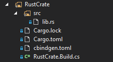

# Rust code in Unreal Engine

I recently finished a proof of concept for getting Rust code integrated into Unreal Engine.

I've written a full writeup [here](https://github.com/ejmahler/UnrealEngine/blob/rust-modules/RustPost/RustInUnreal.md). You'll need to be logged into GitHub with an account that has access to the Unreal Engine source code. If not, the link will look like a 404 -- but it's easy to [request access](https://github.com/EpicGames/Signup).

As a quick summary of features I've found to work:

#### Compiling a Rust crate as an Unreal Engine Module

  

#### C++ Unreal modules linking to our Rust crate

    ```c#
    public class DemoGame : ModuleRules
    {
        public DemoGame(ReadOnlyTargetRules Target) : base(Target)
        {
            PublicDependencyModuleNames.AddRange(new string[] {
                "Core",
                "RustCrate"
            });
        }
    }
    ```
    
#### Automatic rebuilding C++ and binaries that depend on Rust code when that Rust code changes

    ```
    1>Building 7 actions with 8 processes...
    1>  [1/7] Compiling rust crate 'test_crate'
    1>     Compiling test_crate v0.1.0 (D:\Documents\Rust\UnrealEngine_RustModules\DemoGame\Source\RustCrate)
    1>      Finished release [optimized + debuginfo] target(s) in 3.24s
    1>  [2/7] test_crate.Editor.pdb
    1>  [3/7] test_crate.Editor.dll
    1>  [4/7] TestCppFile.cpp
    1>  [5/7] UE4Editor-DemoGame.lib
    1>     Creating library D:\Documents\Rust\UnrealEngine_RustModules\DemoGame\Intermediate\Build\Win64\UE4Editor\Development\DemoGame\UE4Editor-DemoGame.lib and object D:\Documents\Rust\UnrealEngine_RustModules\DemoGame\Intermediate\Build\Win64\UE4Editor\Development\DemoGame\UE4Editor-DemoGame.exp
    1>  [6/7] UE4Editor-DemoGame.dll
    1>     Creating library D:\Documents\Rust\UnrealEngine_RustModules\DemoGame\Intermediate\Build\Win64\UE4Editor\Development\DemoGame\UE4Editor-DemoGame.suppressed.lib and object D:\Documents\Rust\UnrealEngine_RustModules\DemoGame\Intermediate\Build\Win64\UE4Editor\Development\DemoGame\UE4Editor-DemoGame.suppressed.exp
    1>  [7/7] DemoGameEditor.target
    1>Total time in Parallel executor: 3.72 seconds
    1>Total execution time: 8.13 seconds
    ========== Build: 1 succeeded, 0 failed, 2 up-to-date, 0 skipped ==========
    ```

#### More

- Packaging Rust binaries along with packaged builds
- Debugging Rust code
- Breakpoints in Rust
- C++ code #including autogenerated cbindgen headers
